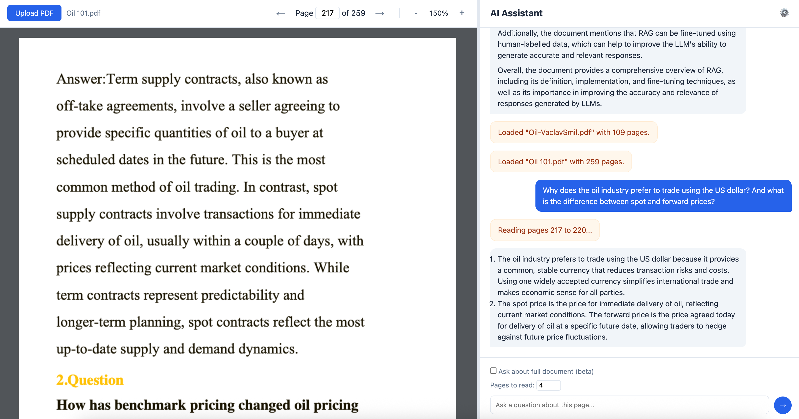

# AI PDF Reader

A lightweight, browser-based application that allows you to view PDF documents and interact with them using an AI assistant. Built with Vanilla JavaScript and PDF.js, it requires no backend server or complex build process—just open it in your browser.



## Overview

AI PDF Reader combines a full-featured PDF viewer with a context-aware chat interface. When you ask a question, the app extracts text from the PDF (either the specific page you're viewing or the entire document) and uses it as context for the AI model. This allows for precise, grounded answers to questions about your documents.

This approach is a practical example of **Retrieval-Augmented Generation (RAG)**: the PDF text is *retrieved* on demand (per page or whole doc) and then *fed into* the large language model so it can incorporate fresh, document-specific knowledge while answering.

## Features & Implementation

1. **Read Any PDF in the Browser**  
   Smooth navigation—page controls, zoom buttons, and keyboard-friendly overlays—powered by PDF.js without needing plugins or installs.

2. **Smart Text Extraction**  
   The app quietly grabs the text from each page you view and keeps it cached, so asking follow-up questions or running searches feels instant.

3. **Ask About a Page or the Whole Document**  
   Toggle between “this page only” and “full document” modes; the assistant automatically decides how much context to send to the AI to keep answers grounded.

4. **Use Your Preferred AI Provider**  
   Plug in any OpenAI-compatible key and endpoint (OpenAI, Azure, LM Studio, local proxies, etc.). Everything stays in your browser’s local storage.

5. **Real-Time Answers**  
   Responses stream into the chat bubble token-by-token, so you see the answer forming just like in modern chat apps.

6. **Run Locally with WebGPU**  
   Switch to “Local Device (WebGPU)” to load ONNX models directly in the browser. A background worker handles downloads, progress feedback, and WebGPU/CPU fallbacks.

7. **Stay Private**  
   PDFs never leave your machine; only the extracted text and your question go to the AI endpoint you configure. No servers, no telemetry.

> **Security Note:** Your API Key is stored in your browser's **Local Storage** (`localStorage`). It remains on your device and is only sent directly to the AI provider you configure.


## How it Works

The application communicates with the AI model by sending a structured prompt that includes your question and the relevant text extracted from the PDF.

### Prompts
1.  **System Prompt**: Defines the AI's role.
    *   *Single Page*: "You are a helpful AI PDF assistant. You have access to the content of PAGE {pageNum} of the document provided below..."
    *   *Full Document*: "You are a helpful AI PDF assistant. You have access to the full content of the document provided below..."
2.  **User Message**: Contains the context and your query.
    ```text
    Document Content:
    {extracted_text_from_pdf}

    Question: {your_question}
    ```

## Technology Stack

-   **Frontend**: HTML5, CSS3, Vanilla JavaScript
-   **PDF Rendering**: [PDF.js](https://mozilla.github.io/pdf.js/)
-   **Markdown Rendering**: [Marked.js](https://marked.js.org/)
-   **No Build Step**: No Webpack, Vite, or Node.js required for the core app.

## Component Flow

1. **`index.html`**  
   Hosts the entire UI (PDF viewer, chat area, settings modal) and loads the other scripts in order: the Transformers bundle, the shared model registry, and finally the main `app.js`.

2. **`app.js`**  
   Acts as the controller. It wires up PDF.js rendering, handles chat logic, reads/writes settings, and manages the local-model worker lifecycle.

3. **`public/models.js`**  
   Exposes `MODEL_REGISTRY`, a single source of truth for available local models (friendly names, dtype hints, reasoning flags). `app.js` consumes this to build the dropdown and to inform the worker which model to load.

4. **`public/transformers.iife.js` → `public/transformers_lib.js`**  
   Provides the inlined Transformers.js bundle (`TRANSFORMERS_LIB`). `app.js` injects this code into the worker so the browser can create a Blob-based worker even when running from `file://`.

5. **`public/worker.js` / Inline Worker Code**  
   Once spawned, the worker receives `MODEL_REGISTRY` and the selected model ID, downloads the tokenizer/model via Transformers.js, and streams tokens back to the UI. It keeps heavy computation and WebGPU access off the main thread.

## Getting Started

### Prerequisites
-   A modern web browser (Chrome, Firefox, Safari, Edge).
-   An API Key from an OpenAI-compatible provider (e.g., OpenAI, DeepSeek, or a local server).

### Installation
1.  Clone or download this repository.
2.  That's it! There are no dependencies to install.

### Usage
1.  **Open the App**: Double-click `index.html` to open it in your web browser.
2.  **Configure API**:
    -   Click the **Settings (⚙️)** icon in the chat header.
    -   Enter your **API Key**.
    -   (Optional) Update the Base URL (default: `https://api.openai.com/v1`) or Model Name (default: `gpt-4o-mini`).
    -   Click **Save**.
3.  **Upload a PDF**: Click the **Upload PDF** button and select a file.
4.  **Use a Local LLM (optional)**:
    -   In **Settings → Model Source**, choose **Local Device (WebGPU)**.
    -   Pick a model from the dropdown (populated by `public/models.js`) and click **Load Model**.
    -   Wait for the download/compile progress bar to complete; once you see “Model Loaded ✅”, all future chats stay on-device.
5.  **Start Chatting**: Navigate to a page and ask a question!

## Customization

You can easily modify the `style.css` to change the look and feel, or update `app.js` to add support for different API formats if needed.
